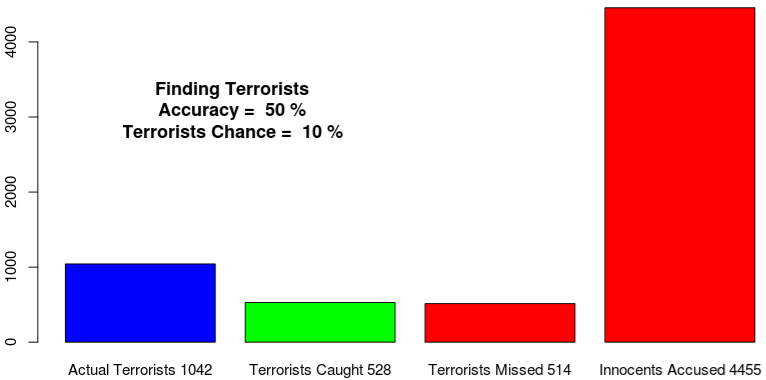

## Accuracy of the test is important

1. Given a population of 10,000 citizens, and a "terrorist rate" of .005 (approximately 50 terrorists), how accurate must a test be to detect only terrorists and leave innocent citizens free?
2. You control the accuracy of the test and how likely a person is to be a terrorist.
3. Note: for this stochastic simulation, a fixed random seed is used to keep results consistent.
4. The goal should be to maximize the number to terrorists caught and minimize the citizens that get jailed.
5. The citizens being jailed are shown in red,
and the terrorists caught are green.
6. Another metric you may want to see is how likely a person in jail is to be a terrorist.  Just compare the terrorists caught to innocent citizens jailed.
7. You might be surprised at how accurate the test should be to keep innocent people out of jail! 

---

## Motivations
  I have tried explaining this concept to software engineers for years.  When I mention "the probability of A given the probability of B," their eyes tend to glaze over and they get confused.  So I decided to write a stochastic simulation that provides the same level of insight and computer science folks have found this easy to follow.
  
  This is actually based on a simulation I did for how accurate a software test needs to be to identify a bug.  That code is here: https://github.com/johng42/bugaccuracy
  
  One interesting aspect of this is that I kept the code as simple as possible and sacrificed performance and other optimizations.  This makes it easy for a larger audience to understand the code, and therefore the results of the exercise.
  
  Anecdotally, the accuracy of deployed tests is around 60%.  

---

## The simulation

  The heart of the code is this section:

        r<-runif(1)        
        if (r<testAccy) {
            #then we have accurately discovered if this person is a terrorist or innocent
            #this code is written for simplicity of understanding, not performance
            if(citizens[i]=="Terrorist"){ tp=tp+1 }
            if(citizens[i]=="Innocent") { tn=tn+1 }
        }
        #this means the test was inaccurate
        #again, simplicity, not performance
        if(r>= testAccy){
            if(citizens[i]=="Terrorist"){ fp=fp+1 }
            if(citizens[i]=="Innocent") { fn=fn+1 }          
        }

---

# Definitions

    tp is true positives.  This is the sum of terrorists identified as terrorists
    tn is true negatives.  This is the sum of innocent citizens identified as innocent
    fp is false positives. This is the sum of innocent citizens identified as terrorists
    fn is false negatives. This is the sum of terrorists identified as innocent

# Sample Output
{{{ content }}}
</img>

